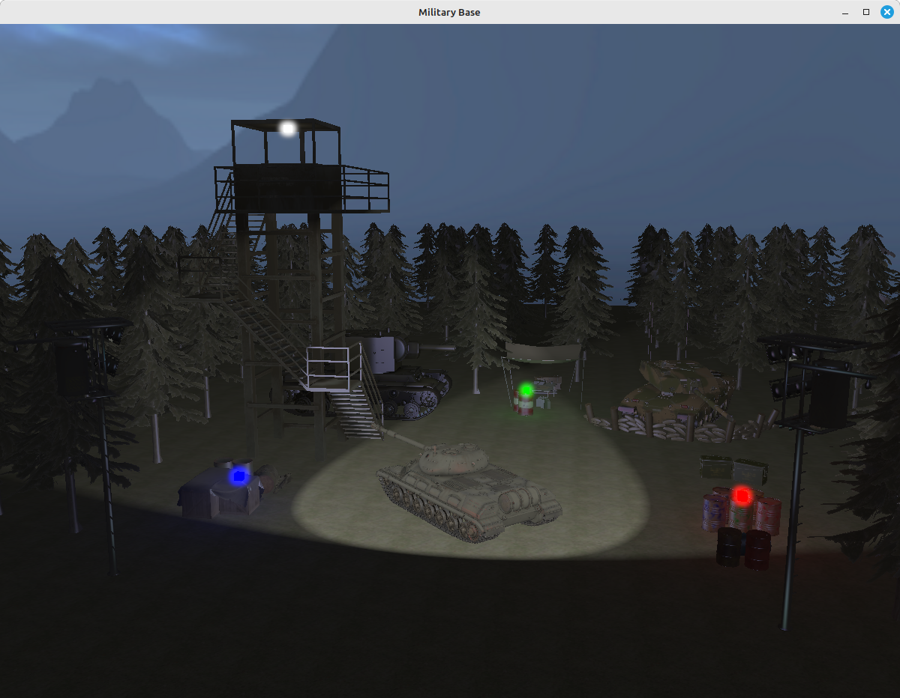

# Military Base
Projekat iz kursa Računarska grafika na Matematičkom fakultetu u Beogradu

## Implementirani efekti:
- Grupa A:
- [x] Cubemaps/Skybox

## Pokretanje

Pokretanje se vrši uz pomoć `CMakeLists.txt`
```shell
$ mkdir build
$ cd build
$ cmake ..
$ make
$ cd ..
$ ./project_base
```

## Korišćenje

Pomoću WASD dugmića i miša korisnik se kreće po terenu

## Resursi

- "Tank T-10M" (https://skfb.ly/6QUSX) by yanix is licensed under Creative Commons Attribution (http://creativecommons.org/licenses/by/4.0/).
- "Crates And Barrels" (https://skfb.ly/oKL8Q) by Mateusz Woliński is licensed under Creative Commons Attribution (http://creativecommons.org/licenses/by/4.0/).
- "Watchtower" (https://skfb.ly/oSsKN) by adventurer is licensed under Creative Commons Attribution (http://creativecommons.org/licenses/by/4.0/).
- "Ammo Box" (https://skfb.ly/6ZBFQ) by murilojones is licensed under Creative Commons Attribution (http://creativecommons.org/licenses/by/4.0/).
- "Rusty oil barrels" (https://skfb.ly/o6Dpr) by Helindu is licensed under Creative Commons Attribution (http://creativecommons.org/licenses/by/4.0/).
- "Oil Drums" (https://skfb.ly/6RJXU) by Oliver Triplett is licensed under Creative Commons Attribution (http://creativecommons.org/licenses/by/4.0/).
- "Kv2 lowpoly" (https://skfb.ly/DJZJ) by Comrade1280 is licensed under Creative Commons Attribution (http://creativecommons.org/licenses/by/4.0/).
- "Low Poly Reflector" (https://skfb.ly/ozPYp) by AstorMilanese is licensed under Creative Commons Attribution (http://creativecommons.org/licenses/by/4.0/).
- "Pine Forest" (https://skfb.ly/6Rpur) by fangzhangmnm is licensed under Creative Commons Attribution (http://creativecommons.org/licenses/by/4.0/).
- "Challenger 2 - Shooting Range" (https://skfb.ly/6UQpK) by Tom Zimmermann is licensed under Creative Commons Attribution (http://creativecommons.org/licenses/by/4.0/).
- "Tripod Omni Directional Lamp" (https://skfb.ly/6tBEt) by Rakshaan is licensed under Creative Commons Attribution (http://creativecommons.org/licenses/by/4.0/).
- Ground: https://www.independent-software.com/tileable-repeatable-hires-terrain-textures-for-download.html

## Slika projekta

